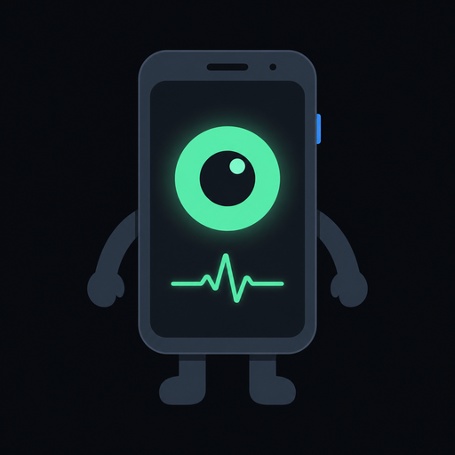

<p align="center">
  
</p>

<h1 align="center">Asistanım Cebimde</h1>

<p align="center">
  <b>Çekmecede duran eski Android telefonu, 7/24 yaşayan; gören, duyan, konuşan ve senin adına telefon eden kişisel asistana dönüştür.</b><br/>
  Cebindeki telefondan ona yazarsın; o eski telefonun içinden dünyaya bakar, dinler, arar, konuşur ve sana rapor verir.
</p>

<p align="center">
  <a href="https://github.com/AppleCurse/asistanim-cebimde/releases/latest">📦 Son sürümü indir</a> ·
  <a href="#6-kurulum--adım-adım">🛠 Kurulum</a> ·
  <a href="#7-kullanım">📱 Kullanım</a> ·
  <a href="#10-sorun-giderme">🩺 Sorun giderme</a> ·
  <a href="docs/">📚 Derin dokümanlar</a>
</p>

---

## İçindekiler

1. [Bu proje ne işe yarar?](#1-bu-proje-ne-işe-yarar)
2. [Neler yapabilir? (örneklerle)](#2-neler-yapabilir-örneklerle)
3. [Neler yapamaz? (dürüst sınırlar)](#3-neler-yapamaz-dürüst-sınırlar)
4. [Nasıl çalışır? (2 dakikada mimari)](#4-nasıl-çalışır-2-dakikada-mimari)
5. [Gereksinimler](#5-gereksinimler)
6. [Kurulum — adım adım](#6-kurulum--adım-adım)
7. [Kullanım](#7-kullanım)
8. [Ayarlar — her alan tek tek](#8-ayarlar--her-alan-tek-tek)
9. [Günlük yönetim: başlat, durdur, izle, güncelle](#9-günlük-yönetim-başlat-durdur-izle-güncelle)
10. [Sorun giderme](#10-sorun-giderme)
11. [Güvenlik modeli](#11-güvenlik-modeli)
12. [Depo yapısı](#12-depo-yapısı)
13. [API — geliştiriciler için](#13-api--geliştiriciler-için)
14. [Telefon olmadan geliştirme ve testler](#14-telefon-olmadan-geliştirme-ve-testler)
15. [Yol haritası](#15-yol-haritası)
16. [Sık sorulan sorular](#16-sık-sorulan-sorular)
17. [Etik ve hukuk](#17-etik-ve-hukuk)

---

## 1. Bu proje ne işe yarar?

Elinde eski bir Android telefon var (bizimki: **Xiaomi Redmi Note 8**, 4 GB + 1 GB genişletilmiş RAM, 8 çekirdek, root yok). Bu proje o telefonu şuna çevirir:

- **Sürekli açık bir sunucu** — şarjda durur, Wi-Fi'ye bağlıdır, uyumaz, ölürse kendi kendine yeniden doğar, telefon yeniden başlasa bile kalkar.
- **Bedeni olan bir yapay zekâ** — kamerası gözü, mikrofonu kulağı, hoparlörü ağzı, telefon hattı ve SMS'i elleri olan bir asistan. Beyni bulut LLM'leri (Claude, GPT, Gemini, DeepSeek… hangisini bağlarsan) — hepsine **tek musluktan** ([9router](https://github.com/decolua/9router)) erişir.
- **Cebinden yönettiğin bir asistan** — kendi telefonundaki panel (uygulama gibi kurulur) üzerinden ona yazarsın: *"etrafa bak"*, *"pil kaç?"*, *"Ahmet'i ara, yarınki toplantıyı 16:00'a ertele"*. O da yapar, sana anlatır, hafızasına not düşer.

Kısacası: **"asistanım cebimde"** — ama asistan aslında evdeki eski telefonda yaşıyor; cebinde sadece kumandası var.

### Kimin için?
- Elinde atıl bir Android telefon olan ve "bu bir işe yarasın" diyen herkes.
- Kendi yapay zekâ asistanını **kendi cihazında** barındırmak isteyen (verilerin telefonunda kalır; yalnızca LLM istekleri seçtiğin sağlayıcıya gider).
- Randevu alma, teyit, sipariş gibi telefon işlerini asistana devretmek isteyen (bkz. [§3](#3-neler-yapamaz-dürüst-sınırlar): bu kısım VoIP hattı ister — SIP/baresip köprüsü hazır).

---

## 2. Neler yapabilir? (örneklerle)

Panelden ya da terminalden yazdığın cümleye göre asistan uygun **aracı** kendisi seçer. Aşağıdakiler bugün çalışan yetenekler:

| Sen dersin ki… | Asistan ne yapar | Kullandığı araç |
|---|---|---|
| "Etrafa bak, kim var?" | Kamerayla fotoğraf çeker, görüntüyü LLM'e verir, gördüğünü anlatır | `bak` |
| "Masadaki QR kodu oku" | Fotoğraf çeker, QR/barkodu çözer | `qr_oku` |
| "Odayı 10 saniye dinle, ne konuşuluyor?" | Mikrofonu açar, konuşmayı yazıya çevirir | `dinle` |
| "Hoparlörden 'yemek hazır' de" | Telefonun hoparlöründen sesli söyler (Android TTS, ücretsiz) | `soyle` |
| "Pil kaç, şarjda mı?" | Pil yüzdesi, şarj durumu, sıcaklık | `pil_durumu` |
| "Ahmet'in numarası ne?" | Rehberde arar | `kisi_bul` |
| "Ayşe'ye 'geç kalacağım' yaz" | SMS gönderir (izin açıksa) | `sms_gonder` |
| "Son gelen mesajları oku" | Gelen kutusunu listeler | `sms_oku` |
| "Kimler aramış?" | Arama kayıtlarını listeler | `arama_kayitlari` |
| "Telefon nerede?" | Yaklaşık konum | `konum` |
| "Bana 'ilacını al' bildirimi at" | Eski telefonun ekranına bildirim düşürür | `bildirim_gonder` |
| "Şunu unutma: bakkal 21:00'de kapanıyor" | Kalıcı hafızaya yazar; sonraki sohbetlerde hatırlar | `hatirla` |
| "Bakkalla ilgili ne biliyorsun?" | Hafızada arar | `hafiza_ara` |
| "Dişçiyi ara, Perşembe randevumu bir hafta ertele" | **Görüşme görevi** planlar: kimi arayacak, ne söyleyecek, neye evet diyebilir, neye asla — panelde onaya sunar | `gorev_olustur` |
| "Saat kaç?" | Tarih/saat | `saat` |

Bunlara ek olarak:

- **Sesli sohbet:** Panelin 📞 Telefon sayfasından asistanla **konuşarak** sohbet edersin (cebindeki telefonun mikrofonu ve hoparlörüyle, ücretsiz).
- **Görüşme provası:** Planlanan bir görevi önce sen "karşı taraf" olarak oynayıp asistanın nasıl konuşacağını dinlersin.
- **VoIP'tan arama (asistan konuşur):** Görev kartındaki **📳 VoIP'tan ara** ile asistan numarayı internet hattından (SIP/baresip) arar ve kendi sesiyle konuşur. Ses kanalı sağlığı `ses-testi.sh` ile doğrulanır; test yeşil olmadan arama açılmaz.
- **Hattan çevirme:** Görev için eski telefonun SIM'inden numarayı çevirir, konuşma notlarını ekranında gösterir; konuşmayı sen yaparsın, sonucu girersin, hafızaya yazılır.
- **Kayıt silme:** Her görev kartındaki **🗑 Kaydı sil** ile brifing + transkript kalıcı olarak silinir (mahremiyet: ses kaydı zaten saklanmaz, sadece metin transkripti durur).
- **Kalıcı hafıza:** `~/.asistan/hafiza.md` — düz metin; sen de elle düzenleyebilirsin.
- **Her yerden yönetim:** Aynı Wi-Fi'de doğrudan; dışarıdan Tailscale ile; kod/terminal/masaüstü için [9remote](https://github.com/decolua/9remote).

---

## 3. Neler yapamaz? (dürüst sınırlar)

- **Eski telefonun SIM'iyle "konuşamaz".** Root'suz Android, uygulamalara çağrı sesini vermez: asistan numarayı çevirebilir ama hatta kendi sesini basamaz, karşı tarafı duyamaz. Bu Android'in kısıtı, kodun değil. Asistanın **gerçekten arayıp konuşması** için ses internet hattından (VoIP/SIP) geçer — **baresip/SIP köprüsü entegre** (Zadarma; ses kanalı gözcüsü + arama kapısı + `ses-testi.sh` teşhisi). Ayrıntı, maliyet ve seçenekler: [docs/telefon-gorusmesi.md](docs/telefon-gorusmesi.md).
- **Gerçek cihaz doğrulaması:** Redmi Note 8 (Snapdragon 665, Android 10/11 MIUI) hedef cihazdır. Bu kod oturumunda gerçek telefona/ADB’ye erişim yok; kamera, mikrofon, pil, Android TTS, arka plan servisi ve HTTPS paneli donanım üzerinde yeniden doğrulanmadı. Otomatik testler mock cihaz kullanır.
- **Çevrimdışı düşünemez.** Beyin buluttaki LLM'dir; internet yoksa sadece "beden" (kamera, TTS, bildirim) çalışır.
- **Kamerayı ekran kilitliyken bazı MIUI sürümleri vermez.** Çözüm §10'da.
- **Bir kişilik, bir cihaz.** Çok kullanıcılı/ölçeklenebilir bir sistem değil; dayanıklı bir ev asistanı.

---

## 4. Nasıl çalışır? (2 dakikada mimari)

```
   CEBİNDEKİ TELEFON                              ESKİ TELEFON (Redmi Note 8, Termux)
  ┌────────────────────┐                    ┌──────────────────────────────────────────────────┐
  │ Panel (PWA)        │  https :20131      │ BEYİN   beyin/index.mjs                           │
  │  • sohbet          │◄──────────────────►│  ajan döngüsü + araçlar + görevler + web paneli   │
  │  • görevler        │  ws  /ws/telefon   │  └─ köprü: görüşme motoru (dinle→düşün→konuş)      │
  │  • 📞 yazılım tel. │                    │        │ http :20130 (token)                       │
  │ 9remote (PWA)      │◄── WebRTC P2P ────►│ BEDEN   beden/server.mjs ── Termux:API ── donanım  │
  └────────────────────┘                    │        │ http :20128/v1                            │
                                            │ 9ROUTER LLM + STT + TTS musluğu → 40+ sağlayıcı    │
                                            │ (proot Ubuntu) 9remote ── IDE / terminal / ekran   │
                                            └──────────────────────────────────────────────────┘
```

| Organ | Ne | Nasıl |
|---|---|---|
| 🧠 **Beyin** | Muhakeme, planlama, konuşma | 9router → istediğin LLM; OpenAI uyumlu tek uç `http://127.0.0.1:20128/v1` |
| 👁 **Göz** | Görme, yüz/QR/yazı | `termux-camera-photo` → ffmpeg ile küçült → görüntü modeline |
| 👂 **Kulak** | Dinleme | Android konuşma tanıma (ücretsiz) **veya** 9router `/audio/transcriptions` |
| 👄 **Ağız** | Konuşma | Android TTS (ücretsiz, çevrimdışı) **veya** 9router `/audio/speech` |
| ✋ **Eller** | Telefon, SMS, bildirim, pano, konum, fener | Termux:API |
| ❤️ **Kalp** | Ölürse doğ, açılışta kalk, uyuma | `servis.sh` döngüsü + Termux:Boot + wake-lock |
| 🔌 **Sinir sistemi** | Her yerden içeri | Panel (token) + 9remote (P2P, fiziksel onay) + sshd |
| 📞 **Köprü** | Telefon görüşmesi motoru | `beyin/kopru/` — tarayıcı + VoIP/SIP (baresip) |

Akış, bir örnekle: Sen panelden *"etrafa bak"* yazarsın → **Beyin** LLM'e mesajı ve araç listesini gönderir → LLM `bak` aracını ister → Beyin **Beden**'e `POST /kamera/cek` der → Beden `termux-camera-photo` çalıştırır, ffmpeg ile 1280 px'e küçültür, base64 döner → Beyin görüntüyü LLM'e "işte gördüğün" diye verir → LLM anlatır → panelde yanıt + fotoğraf.

Derinlemesine: [docs/mimari.md](docs/mimari.md)

---

## 5. Gereksinimler

### Donanım
- **Eski telefon:** Android 7+ (arm64). Test hedefi Redmi Note 8 (Android 9–11, MIUI 12.x). 3 GB RAM asgari, 4 GB rahat. Sürekli şarjda duracak.
- **Cebindeki telefon:** Herhangi bir telefon/tablet/bilgisayar; Android Chrome sesli görüşme için en iyisi.
- Aynı Wi-Fi (ilk kurulum için); dışarıdan erişim için Tailscale (ücretsiz).

### Eski telefona kurulacak uygulamalar (hepsi **F-Droid**'den — Play Store sürümleri bakımsız, uyumsuz)
| Uygulama | Zorunlu mu | Ne için |
|---|---|---|
| **Termux** | Evet | Linux ortamı; her şey bunun içinde çalışır |
| **Termux:API** | Evet | Kamera, mikrofon, telefon, SMS, bildirim erişimi |
| **Termux:Boot** | Önerilir | Telefon açılınca asistanın kendiliğinden kalkması |
| **Tailscale** | İsteğe bağlı | Dışarıdan güvenli erişim |

### Hesaplar
- **Bir LLM sağlayıcısı.** 9router'ın panelinden ücretsiz katmanlar bağlanabiliyor (OpenCode Free kayıtsız; Kiro; Vertex kredisi…) ya da kendi OpenAI / Anthropic / Gemini / DeepSeek / Groq anahtarın. Para ödemeden başlanabilir.
- Sesli görüşmede sunucu sesi istersen 9router'a bir STT/TTS sağlayıcısı (Whisper, Gemini, Groq, ElevenLabs…) — **zorunlu değil**, cebindeki telefonun kendi tanıma/okuma motoru ücretsiz çalışır.
- Gerçek arama (VoIP) için SIP hesabı (ör. Zadarma) gerekir; `.env`'ye `SIP_*` bilgilerini yaz, `bash scripts/proot/baresip-kur.sh` ile yapılandır. Ayrıntı: [docs/telefon-gorusmesi.md](docs/telefon-gorusmesi.md).

---

## 6. Kurulum — adım adım

Toplam süre ilk seferde 30–40 dakika (paket indirmeleri dahil). Komutlar **eski telefonun** Termux'una yazılır. Klavyeyle uğraşmamak için Termux'ta `pkg install openssh && passwd && sshd` deyip bilgisayardan `ssh -p 8022 u0_aXXX@<telefon-ip>` ile bağlanabilirsin (kullanıcı adını `whoami` verir).

### 6.1 Telefonu hazırla (5 dk)

1. Telefonu sıfırla ya da gereksiz uygulamaları kaldır; Google hesabı ekle (konuşma tanıma için Google uygulaması gerekir).
2. Wi-Fi'ye bağla. **Ayarlar → Wi-Fi → Gelişmiş → Uyku modunda Wi-Fi açık kalsın: Her zaman.**
3. **Ayarlar → Ek ayarlar → Bellek genişletme** açık olsun (4 + 1 GB).
4. Geliştirici seçeneklerini aç (Ayarlar → Telefon hakkında → MIUI sürümüne 7 kez dokun). İçinde **"Ekran açıkken uyanık kal"** (şarjda) açılabilir; **"MIUI optimizasyonu"** kapatmak arka plan öldürmeyi azaltır (isteğe bağlı).
5. F-Droid'i kur (f-droid.org), oradan **Termux**, **Termux:API**, **Termux:Boot** kur.
6. **Ayarlar → Uygulamalar → Termux:API → İzinler:** Kamera, Mikrofon, Telefon, SMS, Kişiler, Konum, Bildirim → hepsine izin ver. **Termux** için de aynıları.
7. **MIUI pil yönetimi:** Termux, Termux:API, Termux:Boot için ayrı ayrı: Pil tasarrufu → **Kısıtlama yok**; **Otomatik başlat** → aç. Son uygulamalar ekranında Termux'u aşağı çekip **kilitle**.

### 6.2 Termux'u ilk kez aç (2 dk)

```bash
pkg update -y && pkg upgrade -y
termux-setup-storage        # "Depolamaya izin ver" → İzin ver (Downloads'a erişim için)
```

### 6.3 Projeyi indir ve kur (10–15 dk)

**Yol A — tek satır (önerilen):**

```bash
curl -fsSL https://github.com/AppleCurse/asistanim-cebimde/releases/latest/download/indir-kur.sh | bash -s -- --tls
```

- `--tls` → panel için HTTPS sertifikası üretir (tarayıcıda **mikrofon** ancak HTTPS'te açılır; sesli sohbet istiyorsan ekle).
- `--proot` → Ubuntu + 9remote de kurulur (≈ 1 GB indirme, +10 dk; sonra da yapılabilir: `bash scripts/proot/ubuntu-kur.sh`).
- `--sadece-indir` → indirir, kurmaz.

**Yol B — zip:** [Sürümler](https://github.com/AppleCurse/asistanim-cebimde/releases/latest) sayfasından `asistanim-cebimde-vX.Y.Z.zip`'i telefonun tarayıcısıyla indir, sonra:

```bash
pkg install -y unzip
unzip -o ~/storage/downloads/asistanim-cebimde-v*.zip -d ~/
bash ~/asistanim-cebimde/scripts/termux/kur.sh --tls
```

**Yol C — git (geliştirme):**

```bash
pkg install -y git
git clone https://github.com/AppleCurse/asistanim-cebimde ~/asistanim-cebimde
bash ~/asistanim-cebimde/scripts/termux/kur.sh --tls
```

`kur.sh` sırasıyla şunları yapar ve her adımı yeşil ▶ ile yazar:
1. `pkg` güncelleme.
2. Paketler: `nodejs-lts git termux-api openssh ffmpeg jq zbar openssl-tool iproute2 curl` (+ `proot-distro` istendiyse).
3. `npm install` (tek bağımlılık: `ws`).
4. `npm install -g 9router`.
5. `~/.asistan/` dizini, `config.json` (varsayılanlarla), `beden.token`, `beyin.token`.
6. `.env` yoksa `.env.example`'dan kopyalar.
7. `--tls` ise sertifika; `--proot` ise Ubuntu.
8. `termux-battery-status`, `termux-camera-info`, `termux-tts-engines` çalıştırır → **Android izin pencereleri burada çıkar, hepsine izin ver.**
9. "Sıradaki adımlar" listesini basar.

Bittiğinde doğrula:

```bash
termux-battery-status            # {"percentage": 87, ...} dönmeli
termux-camera-info               # kameraları listelemeli
termux-tts-speak "merhaba"       # hoparlörden konuşmalı
termux-speech-to-text            # bir şey söyle → yazıya dökmeli
node -v && 9router --version
```

`termux-speech-to-text` boş dönerse: Google uygulaması ve **Speech Services by Google** kurulu, Türkçe çevrimdışı paket indirilmiş olmalı (Ayarlar → Sistem → Diller ve giriş → Konuşma).

### 6.4 9router'ı başlat, beyni bağla (5 dk)

9router, bulut LLM sağlayıcılarına bağlanan OpenAI uyumlu yerel ağ geçididir. `baslat.sh` komutu 9router'ı `scripts/termux/9router-servis.sh` üzerinden arka planda, TUI terminali gerektirmeden ve RAM tüketimini sınırlayarak (`--max-old-space-size=512`) kesintisiz çalıştırır.

Elle test etmek için:

```bash
bash scripts/termux/9router-servis.sh
```

Aynı Wi-Fi ağındaki bilgisayardan veya cep telefonundan `http://<telefon-ip>:20128` (veya eski telefondan `http://localhost:20128`) adresini açın. İlk giriş şifresi: `asistan123`.

1. **Providers** → bir sağlayıcı bağla. Para harcamadan başlamak için **OpenCode Free** (kayıt yok) veya **Kiro** (aylık ücretsiz kredi); kendi anahtarın varsa OpenAI / Anthropic / Gemini / DeepSeek / Groq… 
2. **Dashboard** → **API key**'i kopyala (`9r-…` gibi).
3. **Models** listesinden bir model adı seç (örn. `kr/claude-sonnet-4.5`, `oc/…`). Telefon görüşmelerinde hız önemli → hızlı bir model (Groq/Gemini Flash sınıfı) seçmek iyi olur.
4. (İsteğe bağlı) **Speech** sağlayıcısı bağla → sunucu sesi (STT/TTS) için.

9router `baslat.sh` tarafından da arka planda otomatik başlatılır.

### 6.5 .env dosyasını doldur (2 dk)

```bash
cd ~/asistanim-cebimde
nano .env          # Ctrl+O kaydet, Ctrl+X çık
```

En az bunlar:

```env
LLM_API_KEY=9r-buraya-9router-anahtarı
LLM_MODEL=kr/claude-sonnet-4.5        # 9router'daki model adı; boş bırakırsan ilk uygun model seçilir
KULLANICI_ADI="Adın Soyadın"          # asistan aramalarda "X'in dijital asistanıyım" der
ASISTAN_ADI=Aspasia                      # asistanın adı — istediğini koy
```

Model listesini görmek için: `npm run modeller`

### 6.6 Başlat ve paneli aç (1 dk)

```bash
bash scripts/termux/baslat.sh
```

Beklenen çıktı:

```
▶ Uyanık kalma kilidi
▶ Servisler
  sshd (port 8022)
  9router başlatıldı
  beden başlatıldı
  beyin başlatıldı

▶ Durum
  9router  ✓ çalışıyor (pid 1234)
  beden    ✓ çalışıyor (pid 1250)
  beyin    ✓ çalışıyor (pid 1262)
  ...
  Panel (aynı Wi-Fi/Tailscale): https://192.168.1.23:20131/?token=3f9a…
```

O adresi **cebindeki telefonda** aç. HTTPS sertifikası kendinden imzalı olduğu için tarayıcı bir kez "güvenli değil" der → **Gelişmiş → Yine de devam et.** Token adresle birlikte girildiği için çerez kalır; bir daha sormaz.

Panelde **Yaşam belirtileri** kartında "Beden: yaşıyor (termux)" ve pil yüzdesini görüyorsan asistan hayatta. İlk mesajın: *"merhaba, neler yapabiliyorsun?"*

### 6.7 Cebindeki telefona uygulama olarak kur (1 dk)

Panel bir PWA'dır. Android Chrome'da üst çubukta **⬇ Kur** düğmesi belirir → bas → ikonlu, tam ekran uygulama olarak ana ekrana iner (📞 Telefon kısayoluyla). Düğme çıkmazsa tarayıcı menüsünden **Ana ekrana ekle**. iPhone'da Safari → Paylaş → Ana Ekrana Ekle.

### 6.8 Açılışta otomatik başlasın (1 dk)

```bash
bash scripts/termux/boot-kur.sh
```

Sonra **Termux:Boot uygulamasını bir kez aç** (Android kancayı kaydeder). Telefonu yeniden başlat → ~15 sn sonra her şey kalkar (`~/.asistan/log/boot.log`).

### 6.9 (İsteğe bağlı) Dışarıdan erişim — Tailscale

Eski telefona ve cebindekine Tailscale uygulamasını kur, aynı hesapla gir. Eski telefonun Tailscale IP'sini (100.x.y.z) al:

```bash
TAILSCALE_IP=100.x.y.z bash scripts/termux/tls-uret.sh    # sertifikayı o IP ile yenile
bash scripts/termux/durdur.sh beyin && bash scripts/termux/baslat.sh
```

Artık her yerden `https://100.x.y.z:20131` — port açma, DDNS, sabit IP yok.

### 6.10 (İsteğe bağlı) Ubuntu + 9remote — telefonun içine IDE, terminal, masaüstü

```bash
bash scripts/proot/ubuntu-kur.sh        # proot-distro + Ubuntu + Node 22 + 9remote
bash scripts/proot/9remote.sh           # ilk eşleşme: QR çıkar → cebindekiyle okut → "Approve"
ENABLE_9REMOTE=1 bash scripts/termux/baslat.sh   # sonraki başlatmalarda arka planda
```

Depo `/root/asistanim-cebimde`, ayarlar `/root/.asistan` olarak Ubuntu'nun içine bağlanır; 9remote'un IDE'sinden kodu düzenler, Claude Code / Codex'i 9router'a bağlı çalıştırırsın. **Not:** 9remote'un native modülleri (sharp, koffi, node-pty) Termux'un kendi ortamında çalışmaz, bu yüzden Ubuntu şart; 9router ise saf JS olduğu için Termux'ta kalır.

---

## 7. Kullanım

### 7.1 Panel

Üst çubuk: yeşil **nabız** (beden yaşıyor), asistan adı, **📞 Telefon**, **⬇ Kur**, **↻ yenile**.

| Kart | Ne gösterir / ne yapar |
|---|---|
| **Yaşam belirtileri** | Beden durumu (termux/mock), pil % ve sıcaklık, seçili LLM, kulak/ağız sağlayıcısı, çalışma süresi, bellek, ağ adresleri. Dakikada bir yenilenir. |
| **Sohbet** | Asistanla yazışma. Araç kullanırsa altına küçük gri "⚙ bak → hatirla" notu düşer. **👁 Bak** anında fotoğraf çekip gösterir; **🔊 Söylet** yazdığını eski telefonun hoparlöründen söyletir; **Sohbeti sıfırla** bağlamı temizler (hafıza silinmez). |
| **Görüşme görevleri** | Talimat yaz (+ isteğe bağlı numara) → **Planla** → brifing kartı çıkar: başlık, kişi, amaç, konuşma noktaları, eksik bilgi. Kart üstünde: **📞 Tarayıcıdan görüş**, **📳 VoIP'tan ara**, **📱 Hattan çevir**, **İptal**, **🗑 Kaydı sil** (transkript dahil). Bitmiş görevlerde sonuç ve takip listesi. |
| **Hafıza** | `hafiza.md` içeriği — asistanın kalıcı notları. |

### 7.2 Sohbette neler diyebilirsin

Doğal dil yeter; asistan aracı kendi seçer. Tek mesajda birden fazla iş de olur: *"Etrafa bak, kimse yoksa hoparlörden 'ışığı kapatın' de ve bana bildirim at."* Bir araç için izin kapalıysa asistan bunu söyler (*"SMS izni kapalı — config.json → beden.izinler.sms"*).

Görüntüyle ilgili istekler (yüz, yazı, nesne) LLM'in görüntü desteğine bağlıdır; 9router'da görüntü destekli bir model seç (Claude/GPT-4o/Gemini sınıfı).

### 7.3 Görüşme görevleri — birini aratma akışı

1. **Talimat:** *"Diş hekimi Dr. Aylin'i ara, Perşembe 15:00 randevumu bir sonraki haftaya aynı saate al. Olmazsa sabah saatleri de olur. Ücret konuşma."*
2. **Brifing:** LLM bunu yapılandırır: kişi (`Dr. Aylin`, numara rehberden veya senden), amaç, konuşma noktaları (selamla-kendini tanıt-talebi ilet-alternatif sor-teyit et), kabul edilebilir sonuçlar, **sınırlar** (ücret konuşma, başka randevu verme), üslup, açılış cümlesi, başarı kriteri, eksik bilgi. Eksik bilgi varsa durum `taslak` olur, panelde kırmızı yazar → tamamla.
3. **Onay ve mod:**
   - **📞 Tarayıcıdan görüş** — Telefon sayfası açılır; asistan açılış cümlesini söyler; **sen karşı taraf rolünde** konuşursun. Prova ve test için.
   - **📳 VoIP'tan ara** — asistan numarayı SIP hattından arar ve **kendi sesiyle konuşur** (baresip köprüsü). Ses kanalı doğrulanmadıysa arama kapalıdır: `bash scripts/termux/ses-testi.sh`.
   - **📱 Hattan çevir** — eski telefonun SIM'i numarayı çevirir (izin `telefon: true` olmalı), ekranda brifing "kopya kâğıdı" çıkar, konuşmayı sen yaparsın. Bitince görev kartından sonucu gir (API: `POST /api/gorevler/:id/sonuc`).
4. **Sonuç:** Görüşme bitince LLM transkriptten `{başarılı mı, özet, kararlar, takip}` çıkarır; görev `tamamlandi`/`basarisiz` olur; hafızaya "Görüşme #… : özet" düşer.

Asistan görüşmeye **dijital asistan olduğunu söyleyerek** başlar (`arama.aiOlduguSoylensin`), kısa cümlelerle konuşur, yetkisi dışında söz vermez, bitince `[GORUSME_BITTI]` etiketiyle kapatır (etiket kullanıcıya gösterilmez).

### 7.4 Telefon köprüsü (📞 Telefon sayfası)

- **Görev** seç (veya "Serbest sesli sohbet").
- **Ses yolu:**
  - *Tarayıcı sesi* — cebindeki telefonun kendi konuşma tanıma ve okuma motoru. Ücretsiz, hızlı, sağlayıcı gerektirmez. Android Chrome'da en iyi; iOS Safari'de tanıma yok, yazarak devam edersin.
  - *Sunucu sesi* — mikrofon kaydı sunucuya gider, 9router STT yazıya çevirir, yanıt 9router TTS ile mp3 döner. Daha kaliteli ses, sağlayıcı ister.
- **▶ Görüşmeyi başlat** → asistan açılışı yapar. **🎙 Basılı tut ve konuş** ya da **Sürekli dinle** (eller serbest; asistan konuşurken tanıma duraklar ki kendini duymasın). Yazı kutusundan da yazabilirsin.
- Araya girersen (barge-in) çalan yanıt kesilir. **■ Bitir** → özet kartı.

### 7.5 Terminalden kullanım

```bash
cd ~/asistanim-cebimde
npm run sohbet                   # etkileşimli: sen> pil kaç?   (/sifirla, /cik)
node beyin/cli.mjs "etrafa bak"  # tek soru
npm run modeller                 # 9router'daki modeller
```

### 7.6 Hafıza

`~/.asistan/hafiza.md` satır satır notlardır: `- [2026-09-27 22:10] (tercih) Kahveyi sütsüz içer`. Asistan her yanıtta son 6000 karakterini görür (`beyin.hafizaLimiti`). Elle düzenleyebilir, silebilirsin. Görüşme sonuçları `(sonuc)` etiketiyle otomatik eklenir.

---

## 8. Ayarlar — her alan tek tek

İki katman: `~/.asistan/config.json` (kalıcı) ve `~/asistanim-cebimde/.env` (ortam değişkenleri; `baslat.sh` yükler, config'i **ezer**).

### `~/.asistan/config.json`

```jsonc
{
  "kullanici": {
    "ad": "",                       // Asistanın temsil ettiği kişi ("X'in asistanıyım")
    "asistanAdi": "Aspasia",           // Asistanın adı
    "dil": "tr-TR",                 // TTS/STT dili
    "cihaz": "Xiaomi Redmi Note 8 (Termux)"   // Sistem mesajında kendini tanıtırken kullanır
  },
  "beden": {
    "host": "127.0.0.1",            // DEĞİŞTİRME: beden sadece cihaz içinden erişilmeli
    "port": 20130,
    "mod": "otomatik",              // otomatik | termux | mock  (mock = sahte cihaz, geliştirme)
    "fotografGenislik": 1280,       // ffmpeg varsa fotoğraflar bu genişliğe küçültülür (0 = küçültme)
    "izinler": {                    // Her yetenek ayrı anahtar. false → 403 ve LLM'e "izin kapalı"
      "kamera": true, "mikrofon": true, "konusma": true, "bildirim": true, "pano": true,
      "telefon": false,             // termux-telephony-call, arama kayıtları
      "sms": false,                 // gönder + oku
      "konum": false,
      "kisiler": false,             // rehber
      "kabuk": false                // keyfi shell komutu (/kabuk) — LLM'e verilmez, çok dikkatli aç
    }
  },
  "beyin": {
    "host": "0.0.0.0",              // LAN'a açık (token korumalı). Sadece cihaz içi: 127.0.0.1
    "port": 20131,
    "bedenUrl": "http://127.0.0.1:20130",
    "llm": {
      "baseUrl": "http://127.0.0.1:20128/v1",   // 9router (veya herhangi bir OpenAI uyumlu uç)
      "apiKey": "",
      "model": "",                  // boş → /v1/models'tan otomatik (sonnet/gpt-4/gemini/glm/kimi/deepseek tercih)
      "sicaklik": 0.4,
      "sttModel": "whisper-1",      // 9router STT modeli
      "ttsModel": "tts-1",          // 9router TTS modeli
      "ttsVoice": "alloy"
    },
    "stt": "android",               // android | 9router  → `dinle` aracının kulağı
    "tts": "android",               // android | 9router  → `soyle` aracının ağzı
    "maksArac": 8,                  // bir yanıt için en fazla araç turu
    "hafizaLimiti": 6000            // sistem mesajına eklenen hafıza karakteri
  },
  "arama": {
    "varsayilanMod": "tarayici",    // tarayici | hucresel | voip (baresip/SIP — bkz. docs/telefon-gorusmesi.md)
    "aiOlduguSoylensin": true,      // görüşme başında "dijital asistanım" desin
    "maksSure": 900                 // saniye; dolunca görüşme kapanır ve özetlenir
  }
}
```

Değişiklik sonrası: `bash scripts/termux/durdur.sh beden beyin && bash scripts/termux/baslat.sh`

### `.env`

| Değişken | Varsayılan | Açıklama |
|---|---|---|
| `ASISTAN_HOME` | `~/.asistan` | Tüm çalışma verisi |
| `LLM_BASE_URL` | `http://127.0.0.1:20128/v1` | 9router adresi |
| `LLM_API_KEY` | — | 9router panelinden |
| `LLM_MODEL` | (otomatik) | Model adı |
| `STT_MODEL` / `TTS_MODEL` / `TTS_VOICE` | `whisper-1` / `tts-1` / `alloy` | 9router ses modelleri |
| `STT_SAGLAYICI` / `TTS_SAGLAYICI` | `android` | `android` veya `9router` |
| `BEDEN_HOST` / `BEDEN_PORT` | `127.0.0.1` / `20130` | Beden |
| `BEDEN_MOD` | `otomatik` | `mock` → sahte cihaz |
| `BEDEN_TOKEN` / `BEYIN_TOKEN` | dosyadan | Boşsa `~/.asistan/*.token` üretilir |
| `BEYIN_HOST` / `BEYIN_PORT` | `0.0.0.0` / `20131` | Panel |
| `BEDEN_URL` | `http://127.0.0.1:20130` | Beyin→beden |
| `KULLANICI_ADI` / `ASISTAN_ADI` / `CIHAZ_ADI` | — / `Aspasia` / Redmi Note 8 | Kimlik (boşluk varsa tırnakla) |
| `ENABLE_9REMOTE` | `0` | `1` → `baslat.sh` 9remote'u da kaldırır |

### `~/.asistan/` içeriği

```
config.json      ayarlar                       hafiza.md        kalıcı hafıza
beden.token      beyin→beden anahtarı (0600)   gorevler/*.json  görevler: brifing + transkript + sonuç
beyin.token      panel→beyin anahtarı (0600)   sohbet/*.jsonl   sohbet günlükleri (oturum başına)
veri/            fotoğraflar, ses kayıtları    log/             beden.log beyin.log 9router.log boot.log
run/             pid dosyaları                 tls/             cert.pem key.pem (HTTPS)
```

---

## 9. Günlük yönetim: başlat, durdur, izle, güncelle

```bash
cd ~/asistanim-cebimde
bash scripts/termux/baslat.sh              # hepsini başlat (zaten çalışanı atlar)
bash scripts/termux/durum.sh               # kim yaşıyor + sağlık uçları + panel adresi/token
bash scripts/termux/ses-testi.sh           # ses gidiş hattı teşhisi (telefonu ÇALDIRMADAN; arama kapısını açar/kapar)
bash scripts/termux/durdur.sh              # hepsini durdur (wake-lock'u da bırakır)
bash scripts/termux/durdur.sh beyin        # sadece birini
tail -f ~/.asistan/log/beyin.log           # canlı log (beden.log, 9router.log, boot.log)
ls ~/.asistan/veri/                        # çekilen fotoğraflar / kayıtlar
```

**Yeniden doğma:** her servis `servis.sh` döngüsündedir; çökerse 3 sn sonra yeniden başlar; art arda çökmelerde bekleme 6→12→…→60 sn'ye çıkar, 60 sn'den uzun yaşayınca sıfırlanır. Loglara `[servis] beyin çıktı (kod 1), 3s sonra yeniden` düşer.

**Güncelleme:** tek satır kurulumu tekrar çalıştır (paketi üstüne açar; `.env` ve `~/.asistan` korunur), sonra `durdur.sh` + `baslat.sh`. Git ile kurduysan `git pull && npm install`.

**Tokenı yenileme:** `rm ~/.asistan/beyin.token` → yeniden başlat → yeni token; cebindeki tarayıcıda `?token=` ile tekrar gir.

---

## 10. Sorun giderme

| Belirti | Sebep → çözüm |
|---|---|
| Panelde **"Beden: ulaşılamıyor"** | `bash scripts/termux/durum.sh`; `~/.asistan/log/beden.log`. Port çakışması → `.env` `BEDEN_PORT`. |
| Beden **mock** modunda | `termux-battery-status` çalışmıyor → Termux:API **uygulaması** (F-Droid) veya `pkg install termux-api` eksik. |
| **"LLM hazır değil"** / sohbet hata | 9router çalışmıyor (`9router` yazıp panelini aç), `LLM_API_KEY` yanlış, sağlayıcı bağlı değil. Test: `curl -H "Authorization: Bearer $LLM_API_KEY" http://127.0.0.1:20128/v1/models` |
| Kamera **zaman aşımı** (30–45 sn) | Başka uygulama kamerayı tutuyor; izinler; **ekran kilitliyken** bazı MIUI'ler kamerayı vermez → Ayarlar → Kilit ekranı → Yok, parlaklık en düşük; ya da "ekran açık kalsın" + siyah duvar kâğıdı. |
| Mikrofon kaydı **boş** | İzin; arama sırasında mikrofon telefon uygulamasında kilitli olur. |
| `termux-speech-to-text` boş | Google uygulaması / Speech Services / Türkçe paket (§6.3). |
| Servisler **geceleri ölüyor** | MIUI pil kısıtı, otomatik başlat kapalı, Termux kilitlenmemiş (§6.1/7). Wake-lock bildirimi görünmeli. Android 12+ özel ROM'larda phantom process killer: `adb shell device_config put activity_manager max_phantom_processes 2147483647` |
| Panelde **mikrofon izni yok** | Sayfa HTTPS değil → `bash scripts/termux/tls-uret.sh` + yeniden başlat; ya da Chrome `chrome://flags/#unsafely-treat-insecure-origin-as-secure` listesine `http://<ip>:20131` ekle. |
| Sertifika uyarısı her seferinde | Normal (kendinden imzalı). "Gelişmiş → devam" sonrası çerezle girer. IP değiştiyse `tls-uret.sh` ile yenile. |
| 9remote `sharp`/`koffi`/`node-pty` hatası | Termux'ta değil **proot**'ta çalıştır: `bash scripts/proot/9remote.sh` |
| `node-machine-id` hatası (proot) | `/etc/machine-id` yok → `tr -d '-' < /proc/sys/kernel/random/uuid > /etc/machine-id` |
| Bellek doluyor / ısınıyor | 9remote masaüstü akışını sadece gerektiğinde; 9router'a `NODE_OPTIONS=--max-old-space-size=512`; pil sıcaklığı `durum.sh`'ta (42 °C üstü sürekli ise havalandır). |
| 9router **arka planda hemen kapanıyor** | `9router` ikili dosyası etkileşimli terminal (TUI) bekler. Arka planda kesintisiz çalışması için `scripts/termux/9router-servis.sh` kullanılır (`baslat.sh` bunu otomatik yapar). |
| 9router **şifre hatası / mustChangePassword** | 9router uzaktan erişimde varsayılan şifreyi reddedebilir. `INITIAL_PASSWORD=asistan123` ortam değişkeniyle başlatılır, panele `asistan123` ile girilir. |
| Termux:API **izin vermiyor / imza hatası** | Termux, Termux:API ve Termux:Boot uygulamalarının tamamı **aynı kaynaktan** (hepsi F-Droid veya hepsi aynı GitHub release'i) kurulmalı; farklı imza anahtarları Android izinlerini engeller. |
| ADB ile **hızlı arka plan beyaz listesi** | Bilgisayara USB ile bağlıysa tek komutla kısıtlamaları kaldır: `adb shell dumpsys deviceidle whitelist +com.termux +com.termux.api +com.termux.boot` |
| `unzip: cannot find` | `termux-setup-storage` yapılmadı ya da dosya adı farklı: `ls ~/storage/downloads/` |
| Tek satır kurulum "paket bulunamadı" | Sürüm dosyaları henüz yüklenmemiş; script otomatik olarak GitHub kaynak arşivine düşer, sorun değil. |

Daha fazlası: [docs/kurulum.md](docs/kurulum.md), [docs/donanim-notlari.md](docs/donanim-notlari.md)

---

## 11. Güvenlik modeli

1. **Android'de localhost herkese açıktır** — cihazdaki her uygulama `127.0.0.1:20130`'a bağlanabilir. Bu yüzden Beden `/saglik` dışında her istekte `Authorization: Bearer <beden.token>` ister ve yalnızca `127.0.0.1` dinler.
2. **Yetenek bazlı izinler.** Kamera/mikrofon/konuşma/bildirim/pano açık; **telefon, SMS, konum, kişiler, kabuk kapalı** gelir. Her biri bilinçli açılır.
3. **Panel token'sız çalışmaz.** `?token=` ile bir kez gir, çerez kalır; API için `Authorization: Bearer <beyin.token>`. WebSocket de aynı kontrolden geçer.
4. **Dışarıya port açma yok.** Tailscale (P2P, WireGuard) veya 9remote (split-key + fiziksel Approve).
5. **Aramalar insan onaylıdır.** Görevler panelde onayla başlar; LLM hattan aramayı ancak `telefon` izni açıksa yapabilir; görüşmede AI olduğunu söyler.
6. **Kabuk erişimi** LLM'e hiç verilmemiştir; `/kabuk` ucu varsayılan kapalıdır.
7. Tokenlar ve sertifikalar `0600`; `.env` ve `*.token` git'e girmez (`.gitignore`).

---

## 12. Depo yapısı

```
asistanim-cebimde/
├── ortak/ayar.mjs            ayarlar, tokenlar, dizinler, log (~/.asistan)
├── beden/                    TERMUX CİHAZ KÖPRÜSÜ
│   ├── server.mjs            HTTP API (:20130), rota tablosu, izin kapıları, dosya sunumu
│   ├── termux-api.mjs        gerçek cihaz: termux-* komut sarmalayıcıları, ffmpeg küçültme, zbar
│   └── mock.mjs              sahte cihaz (bilgisayarda geliştirme/test)
├── beyin/                    AJAN + PANEL + KÖPRÜ
│   ├── index.mjs             HTTP(S) sunucu (:20131), REST API, statik dosyalar, WS, TLS
│   ├── asistan.mjs           araç kullanan sohbet döngüsü, sistem mesajı, oturumlar, günlük
│   ├── araclar.mjs           16 araç (OpenAI function-calling şeması + çalıştırıcı)
│   ├── gorev.mjs             görüşme görevleri: brifing, kişilik, özet; ~/.asistan/gorevler
│   ├── llm.mjs               9router istemcisi: sohbet, STT, TTS, model seçimi, JSON ayıklama
│   ├── beden-istemci.mjs     beyin→beden HTTP istemcisi
│   ├── hafiza.mjs            hafiza.md okuma/yazma/arama
│   ├── cli.mjs               terminal sohbeti, --modeller
│   ├── kopru/motor.mjs       görüşme motoru (taşıyıcıdan bağımsız)
│   ├── kopru/tarayici.mjs    WebSocket yazılım telefonu taşıyıcısı (/ws/telefon)
│   └── web/                  index.html+panel.js (panel), telefon.html+telefon.js (softphone),
│                             giris.html, stil.css, manifest.webmanifest, sw.js, ikon-*.png
├── scripts/
│   ├── termux/indir-kur.sh   tek satır kurulum (paket indir → kur.sh)
│   ├── termux/kur.sh         Termux kurulumu (--tls, --proot)
│   ├── termux/9router-servis.sh TUI'siz 9router arka plan servisi (--max-old-space-size=512)
│   ├── termux/baslat.sh      sshd + 9router + beden + beyin (+9remote) → servis döngüleri
│   ├── termux/servis.sh      "ölürse yeniden doğur" döngüsü, kademeli bekleme
│   ├── termux/durdur.sh      servisleri durdur      termux/durum.sh   sağlık + panel adresi
│   ├── termux/boot-kur.sh    Termux:Boot kancası    termux/tls-uret.sh  kendinden imzalı sertifika
│   ├── proot/ubuntu-kur.sh   Ubuntu + Node 22 + 9remote  (icerde-kur.sh Ubuntu içinde çalışır)
│   ├── proot/9remote.sh      Ubuntu içinde 9remote (depo ve ~/.asistan bağlı)
│   └── dev/sahte-ortam.mjs   telefon olmadan tam ortam; dev/paketle.sh sürüm paketi
├── test/                     node:test — sahte 9router + sahte cihaz ile uçtan uca (40 test)
├── docs/                     mimari, kurulum, telefon görüşmesi, yol haritası, donanım notları
├── .github/workflows/        surum.yml: release yayınlanınca test + paket + dosya yükleme
├── AGENTS.md                 bu depoda çalışan yapay zekâ ajanları için kurallar
└── .env.example              tüm ortam değişkenleri açıklamalı
```

---

## 13. API — geliştiriciler için

### Beyin (`:20131`, `Authorization: Bearer <beyin.token>` veya `asistan_token` çerezi)

| Yöntem ve yol | Ne yapar |
|---|---|
| `GET /saglik` | (token'sız) yaşıyor mu |
| `GET /api/durum` | beden sağlığı + yetenekler, LLM, ağ, bellek |
| `GET /api/modeller` | 9router model listesi |
| `POST /api/sohbet` `{oturum, metin, resimler?}` | asistan yanıtı `{metin, adimlar, kullanim}` |
| `POST /api/sohbet/sifirla` `{oturum}` | bağlamı temizle |
| `GET/POST /api/hafiza` | oku / `{metin, etiket}` ekle |
| `POST /api/bak` `{kamera}` | fotoğraf (base64) |
| `POST /api/soyle` `{metin}` | hoparlörden söyle |
| `POST /api/pil` | pil |
| `GET/POST /api/gorevler` | listele / `{talimat, numara?}` planla |
| `GET/POST /api/gorevler/:id` | görev / güncelle (`durum`, `kisi`, `mod`, …) |
| `POST /api/gorevler/:id/voip-ara` | VoIP'tan ara (asistan konuşur; ses kanalı kapalıysa 423) |
| `POST /api/gorevler/:id/hucresel-ara` | hattan çevir, brifing döner |
| `POST /api/gorevler/:id/sonuc` `{basarili, ozet, kararlar?, takip?}` | elle sonuç |
| `POST /api/gorevler/:id/sil` | görev kaydını + transkripti kalıcı sil (mahremiyet) |
| `WS /ws/telefon?token=` | görüşme: `{tip:'baslat', gorevId?, mod}` → `{tip:'metin'…}`, ses ikili çerçeve; `{tip:'metin'}`, `{tip:'ses', mime}`+binary, `{tip:'bitir'}` |

### Beden (`:20130`, `Authorization: Bearer <beden.token>`)

`GET /saglik` (açık) · `GET /pil` · `GET /wifi` · `GET /yetenekler` · `GET /kamera/bilgi` · `POST /kamera/cek {kamera}` · `POST /kamera/qr` · `POST /mikrofon/kaydet {sure, format?}` · `POST /mikrofon/dinle` (Android STT) · `POST /konus {metin, dil?}` · `GET /konus/motorlar` · `POST /ses/cal {dosya|base64}` · `POST /ses/durdur` · `POST /telefon/ara {numara}` · `GET /telefon/bilgi` · `GET /telefon/kayitlar` · `POST /sms/gonder` · `GET /sms/liste` · `GET /kisiler` · `GET /konum` · `POST /bildirim {baslik, icerik}` · `POST /titret` · `GET/POST /pano` · `POST /fener {acik}` · `POST /kabuk {komut}` · `GET /dosya/:ad`

Yanıt biçimi: `{ "tamam": true, "sonuc": … }` ya da `{ "tamam": false, "hata": "…" }` (401 yetkisiz, 403 izin kapalı, 400 eksik alan).

### Yeni araç eklemek

`beyin/araclar.mjs` → `arac(ad, açıklama, parametreler, zorunlu, async (args, ctx) => ({ metin, resim? }))`. `ctx` = `{ beden, llm, hafiza, gorevler, ayar, log }`. Tehlikeli işler için Beden tarafında izin kapısı ekle. Test yaz (`test/`). Kurallar: [AGENTS.md](AGENTS.md).

---

## 14. Telefon olmadan geliştirme ve testler

```bash
git clone https://github.com/AppleCurse/asistanim-cebimde && cd asistanim-cebimde
npm install
npm test                           # 40 test: beden API + izinler, ajan döngüsü, görüntü aktarımı,
                                   # brifing, hücresel arama, WebSocket görüşme + özet, yetki
node scripts/dev/sahte-ortam.mjs   # sahte 9router + sahte cihaz + gerçek beyin
                                   # → http://localhost:20131/?token=dev
```

Sahte 9router senaryoludur: "pil" → `pil_durumu` aracı; "bak" → `bak`; telefon sayfasında görüşme + "hoşça kal" ile özet. Gerçek bir 9router'a bağlamak için: `GERCEK_LLM=1 LLM_BASE_URL=… LLM_API_KEY=… node scripts/dev/sahte-ortam.mjs`

Sürüm çıkarmak: `package.json` sürümünü artır → commit → `gh release create vX.Y.Z --target <dal> --generate-notes` → GitHub Actions testleri koşar, `zip/tar.gz/indir-kur.sh` dosyalarını release'e ekler.

---

## 15. Yol haritası

- ✅ **Faz 0 — İskelet (v0.1.0):** beden, beyin, 16 araç, hafıza, görev sistemi, görüşme motoru + tarayıcı yazılım telefonu, PWA panel, Termux yaşam döngüsü scriptleri, proot/9remote kurulumu, indirilebilir sürüm.
- ✅ **Hızlı ve yerel ses/ölçüm:** Piper Türkçe modeli `PIPER_MODEL` ile cihaz içinde, ağsız TTS; Groq/Cerebras arama sağlayıcıları `ARAMA_LLM_*` ile seçilebilir. Kara kutu ölçümleri `~/.asistan/log/kara-kutu.jsonl` dosyasına, günlük maliyet özeti `/api/maliyet` uç noktasına yazılır. `bash scripts/termux/kanarya-kur.sh +905...` her gece 03:00'te ses hattını sınar ve kırmızıysa SMS gönderir.
- ⏳ **Faz 1 — Telefonda canlandırma:** Redmi Note 8 hedefi için Termux:API, arka plan servisi, bellek sınırı, Termux:Boot ve HTTPS paneli kodu mevcut; gerçek cihazda uçtan uca doğrulama bu oturumda yapılmadı (bkz. `docs/yol-haritasi.md`).
- ⏳ **Faz 2 — Duyular:** kayıtlı kişilerle yüz tanıma, QR → aksiyon, OCR akışları, hareket/ses tetikleyicileri ("kim geldi?"), uyandırma kelimesi, gelen SMS/arama özetini söyleme.
- 🔄 **Faz 3 — VoIP köprüsü (gerçek arama):** Baresip SIP (Zadarma) adaptörü, ALSA dosya köprüsü, duvar saatine kilitli PCM besleyicisi, yankı kapısı ve adaptif VAD, çift yönlü ses akışı (Edge-TTS Emel + Groq Whisper), ctrl_tcp arama kontrolü entegre edildi. Ses güvenilirliği katmanı: besleyici kendi kendine iyileştirme, `⚠️ SES KANALI ÖLÜ` gözcüsü, **arama kapısı** (ses testi yeşil olmadan çaldırmaz) ve `scripts/termux/ses-testi.sh` teşhisi. Panelde 📳 VoIP'tan arama + 🗑 kayıt silme.
- ⏳ **Faz 4 — Yaşam:** zamanlayıcılar ("yarın 9'da ara"), tekrarlı görevler, sabah özeti, hafıza konsolidasyonu, push bildirimleri, aile profilleri, isteğe bağlı yerel küçük model.

Madde madde: [docs/yol-haritasi.md](docs/yol-haritasi.md)

---

## 16. Sık sorulan sorular

**Para ödemem gerekiyor mu?** Hayır. Termux, Termux:API, 9router, bu proje ücretsiz; 9router'daki ücretsiz LLM katmanlarıyla başlanır. Kaliteli model istersen kendi API anahtarın (kullandığın kadar). Gerçek telefon araması (Faz 3) dakika ücreti ister.

**Verilerim nereye gidiyor?** Fotoğraf, ses, transkript, hafıza — hepsi eski telefonda (`~/.asistan`). Yalnızca LLM/STT/TTS istekleri seçtiğin sağlayıcıya gider (görüntü ve ses dahil). Mahremiyet için sağlayıcıyı ona göre seç.

**Cebimdeki telefonda uygulama olarak çalışıyor mu?** Evet, PWA: "⬇ Kur" ile ana ekrana iner, tam ekran açılır. Mağazadan yüklenen bir APK değildir.

**Bakkalı arayıp konuşur mu?** Evet — SIP hattı (ör. Zadarma) tanımlıysa asistan **kendi sesiyle** VoIP'tan arar (paneldeki **📳 VoIP'tan ara**). Hat yoksa tarayıcıdan prova yapar veya hattan çevirir, konuşmayı sen yaparsın. Neden ve nasıl: [docs/telefon-gorusmesi.md](docs/telefon-gorusmesi.md).

**Root gerekiyor mu?** Hayır. Her şey Termux + Termux:API ile, root'suz.

**Başka bir telefonda çalışır mı?** Evet, arm64 Android 7+ ve Termux çalışan her cihazda. Daha çok RAM daha rahat.

**Redmi Note 8 yeterli mi?** Evet: MIUI + 9router + beden + beyin ≈ 2.5 GB; 9remote'u gerektiğinde aç. Şarjda ısıya dikkat (§10).

**Eski telefonu ekranı kapalı, kilitli bırakabilir miyim?** Ekran kapalı evet (wake-lock CPU'yu uyanık tutar). Kilitli: bazı MIUI sürümleri kamerayı vermez; kilit ekranını kapatıp parlaklığı kısmak en sağlamı.

**9remote şart mı?** Hayır. Panel ve sshd yönetim için yeter. 9remote, telefonun içinde IDE/terminal/masaüstü istersen.

**Türkçe dışında?** LLM her dilde; TTS/STT dili `kullanici.dil` (örn. `en-US`).

---

## 17. Etik ve hukuk

- Asistan bir görüşmeye başlarken **dijital asistan olduğunu söyler**; sorulursa insan olduğunu asla iddia etmez.
- Görüşme transkriptleri tutulur. Türkiye'de **KVKK** ve **TCK 132–133**: karşı tarafın bilgisi/rızası olmadan ses kaydı yapma; transkript de kişisel veridir, üçüncü tarafla paylaşma.
- Kapsam: **kendi işlerini** yürütmek (randevu, teyit, sipariş, bilgi). Otomatik toplu arama / pazarlama kapsam dışıdır ve mevzuata aykırıdır (ETK 6563, İYS).
- Bu proje kişisel kullanım için geliştirilmektedir; sorumluluk kullanana aittir.

---

<p align="center">
  <sub>Asistanım Cebimde · v0.1.0 · Türkçe geliştirilen, eski telefonlara can veren açık kaynak proje</sub>
</p>
